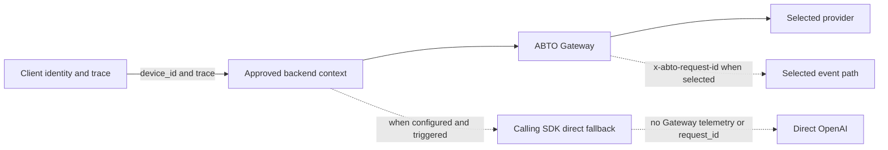

# Discovery and reporting

## Contents

- [Repository map](#repository-map)
- [LLM call inventory](#llm-call-inventory)
- [Event candidates](#event-candidates)
- [Minimal change ledger](#minimal-change-ledger)
- [Three-section output](#three-section-output)

## Repository map

Inspect the current Git root before assuming it is the whole product.
Follow repository-local evidence such as workspace manifests, deployment configuration, API base URLs, generated clients, Git submodules, and documentation links.
Do not scan unrelated home-directory projects merely because they are nearby.

Use this table and ask the user to confirm it before editing:

| Role | Repository | Runtime | Entry point | Evidence | Availability |
|---|---|---|---|---|---|
| Frontend | exact root | framework/runtime | exact path | manifest or request path | confirmed or missing |
| Backend | exact root | framework/runtime | exact path | route or deployment config | confirmed or missing |

List workers, native apps, or additional backends as separate rows.
If a split-repository counterpart is missing, request its exact path or access and stop.

## LLM call inventory

Search every confirmed runtime through all of these evidence classes:

- provider and AI-framework dependencies in manifests and lockfiles;
- imports, client constructors, aliases, factories, dependency injection, and shared wrappers;
- OpenAI Chat Completions, Responses, embeddings, image, audio, and batch methods;
- native Anthropic Messages and Gemini generate-content methods;
- raw HTTP provider hosts, compatible `baseURL` values, and provider endpoint constants;
- provider-key environment variables and configuration that reveal dynamically constructed calls;
- API routes, serverless handlers, workers, queues, scheduled jobs, retries, fallbacks, and streaming branches;
- callers of each wrapper, traced back to the product capability and client trigger.

Exclude vendor directories, generated output, build artifacts, dead examples, and test fixtures only after confirming that they are not deployed application paths.
Do not count an environment variable or import alone as a model call; connect it to executable code or mark it unresolved.

The ABTO Gateway currently accepts OpenAI Chat Completions input.
Provider keys for Anthropic and Gemini are Gateway egress candidates; they do not make native Anthropic or Gemini request shapes eligible for automatic wiring.

Use one row per executable call path:

| ID | Capability | Repository/runtime | Exact call site | API surface | Client/device path | Provider/fallback path | Proposed `featureId` | Status and action |
|---|---|---|---|---|---|---|---|---|

Resolve the installed Calling SDK's fallback configuration and native OpenAI retry setting instead of inferring either from the normal Gateway path.
Capture the base URL each call path used before ABTO: direct fallback needs it as explicit input and has no default.
When direct fallback is enabled, report the trigger conditions, direct provider, and absence of Gateway policy, ABTO telemetry, and `request_id`.

Use only these pre-approval statuses:

- `eligible`: confirmed OpenAI Chat Completions with an unambiguous integration boundary;
- `already wired`: an existing ABTO context reaches the call correctly;
- `incompatible`: the current Gateway cannot preserve the request API or semantics;
- `ambiguous`: a dynamic wrapper, missing caller, unclear capability, or unstable identity prevents a safe change.

Ask one question after the complete table:
“Which eligible IDs should I wire with the proposed locations and featureIds? You can answer `all`, list IDs, add corrections, or exclude IDs.”

After implementation, retain every row and replace `eligible` with `wired` or `user-excluded` as applicable.
Use `blocked-sdk-defect` only when a reproduced defect prevents an otherwise approved path and no compatible fixed public SDK update resolves it.
Do not declare the inventory complete until every search hit is either represented by a row or documented as a non-runtime false positive.

## Event candidates

Inspect confirmed client code for explicit product outcomes, AI prompt submission, response rendering, and response interaction such as accept, reject, copy, insert, retry, rate, share, or download.
Prefer a small set of distinct outcomes over duplicate events at multiple UI layers.

Present both candidate types when supported:

- system: the runtime's current trace helper at an exact observed trigger—Browser `submitPrompt`, `markResponseRendered`, or `captureResponseInteraction`; mobile `submitPrompt`, `markResponseVisible`, or `captureOutcome`;
- custom: a product-domain result with an explicit schema and exact `capture` location.

Offer only explicit system or custom event calls, not automatic DOM collection.
For a response-interaction system event, use only the installed SDK's canonical interaction values.
If actions such as retry do not map exactly to a canonical value such as `regenerated`, keep them as separate custom candidates instead of inventing a system-event string.
Do not invent a conversion event from a button label alone; require evidence that the trigger represents the stated outcome.

| ID | Type | Event/API | Exact trigger | Properties and sources | Measurement purpose | Privacy and request correlation |
|---|---|---|---|---|---|---|

State that the default selection is `none` and ask:
“Which event IDs should I add? You can list multiple IDs or answer `none`.”

## Minimal change ledger

Classify every changed file as one of:

- `Core`: approved dependency, initialization, credential reference, device/trace transport, request validation, or Calling context;
- `Event <ID>`: code required only by one selected system or custom event.

Label an authorized upstream correction as `Core · SDK defect <ID>` or `Event <ID> · SDK defect <ID>`.
Label an explicitly approved customer-side stopgap as `Core · temporary workaround <ID>` or `Event <ID> · temporary workaround <ID>`.

Fail the final diff review if a file or changed block has neither classification.
In particular, reject empty event registries, placeholder events, demo UI, sample endpoints, speculative wrappers, duplicate initialization, unrelated refactors, a second package manager, and a new lockfile convention.

## Three-section output

Use the following headings at every gate and in the final report:

```markdown
## 1. Core · LLM API wiring

Repository map, LLM inventory, approvals, Core changes, SDK defects, verification, and pending items.

## 2. Event candidates · selection result

Candidate table, selected and declined IDs, Event changes, privacy impact, and verification.

## 3. Final integration flow

Core-versus-Event change ledger and the actual Mermaid flow.
```

At a confirmation gate, mark unfinished sections as `Pending user confirmation`.
In the final Mermaid diagram, label Core and Event nodes separately and show only paths that exist after the change:



Replace generic labels with actual repositories, capabilities, and code locations.
Omit the optional Event path when the user selects no events.
Omit the direct fallback branch when the installed configuration disables it.
